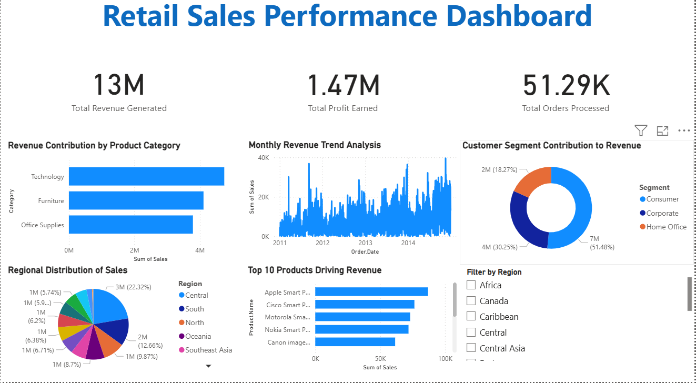

## 📊 Retail Sales Analysis & Dashboard

## 🔍 Project Overview
This project focuses on analyzing retail sales data to extract meaningful business insights. Using Python for data analysis and Power BI for visualization, the project identifies sales trends, top-performing products, and regional performance.

---

## 🎯 Objectives
- Analyze overall sales performance
- Identify top-performing products
- Understand sales trends over time
- Evaluate regional and category-wise performance
- Build an interactive dashboard for business insights

---

## 🛠️ Tools & Technologies
- Python (Pandas, Matplotlib)
- Jupyter Notebook
- Power BI

---

## 📁 Dataset Description
The dataset includes retail transaction data with the following features:
- Product Name
- Category
- Region
- Order Date
- Sales
- Profit
- Customer Segment

---

## 📊 Analysis Performed

### 🔹 Sales by Category
Analyzed which product categories generate the highest revenue.

### 🔹 Regional Sales Distribution
Studied how sales are distributed across different regions.

### 🔹 Monthly Sales Trend
Identified trends and seasonal patterns in sales over time.

### 🔹 Top 10 Products
Determined the highest revenue-generating products.

---

## 💡 Key Insights
- Sales show an overall increasing trend with strong performance in the final months.
- A few top products contribute significantly to total revenue.
- Sales distribution varies across regions, indicating uneven performance.
- Consumer segment contributes the highest share of revenue.

---

## 📈 Power BI Dashboard
The dashboard provides:
- KPI metrics (Total Sales, Profit, Orders)
- Category-wise sales analysis
- Monthly trend visualization
- Customer segment contribution
- Regional distribution of sales
- Top-performing products

---

## 📷 Dashboard Preview

---

## 📌 Business Recommendations
- Focus on high-performing products to maximize revenue.
- Improve strategies in low-performing regions.
- Use seasonal trends for better business planning.
- Diversify product offerings to reduce dependency on top products.

---

## 🚀 Project Files
- `Sales_Analysis.ipynb` → Python analysis
- `clean_superstore.csv` → Dataset
- `Retail Sales Performance Dashboard.pbix` → Power BI dashboard

---

